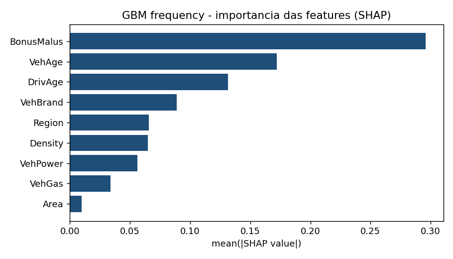

# 🚗 Insurance Pricing Engine


**Tutorial / site:** https://matpasquali.github.io/Insurance_Pricing_Engine/ &nbsp;·&nbsp; **Repositório:** este.

> **PT** · Um motor de **precificação de seguro de automóvel** construído do zero — e, ao mesmo tempo, um **guia didático** do negócio: o que é o seguro, quais KPIs importam e o que realmente faz um bom motor de preço.
>
> **EN** · An auto-insurance **pricing engine** built from scratch, doubling as a hands-on guide to the business: how insurance works, the KPIs that matter, and what makes a good pricing model.

---

## 🧭 Para quem é este repositório

Para **quem está começando no mundo de seguros de automóvel** e precisa entender, de forma sólida:

1. **O negócio** — como uma seguradora ganha (ou perde) dinheiro.
2. **Os KPIs** — a língua que pricing, atuária e portfolio management falam.
3. **O motor de preço** — o que importa de verdade num modelo de precificação.

Cada conceito aparece **explicado** *e* **implementado em código que roda**. Se você ler este README do começo ao fim, sai sabendo conversar sobre pricing de auto com propriedade.

> 💡 **Atalho:** quer só navegar os resultados? Vá para [`notebooks/00_overview.ipynb`](notebooks/00_overview.ipynb). Quer entender o porquê de tudo? Continue aqui.

---

## 📖 Seguro de automóvel em 5 minutos (o negócio)

**Seguro é a venda de uma promessa.** O cliente paga um valor pequeno e **certo** (o **prêmio**) para transferir à seguradora um prejuízo grande e **incerto** (o **sinistro**: batida, roubo, incêndio…). A seguradora junta milhares de clientes: a maioria nunca aciona, alguns acionam — e o prêmio de todos paga os sinistros de poucos.

Isso cria a característica mais peculiar do setor: o **ciclo de produção invertido**. Uma fábrica sabe quanto custa o produto antes de vender. A seguradora **vende primeiro e só descobre o custo depois** (quando — e se — o sinistro acontece). **Precificar é estimar um custo que ainda não existe.** É por isso que o seguro é, no fundo, um negócio de **estatística aplicada**.

### Como a seguradora ganha dinheiro

```
Resultado técnico = Prêmios ganhos − Sinistros − Despesas
```

O termômetro disso é o **Combined Ratio**:

```
Combined Ratio = Loss Ratio (sinistros/prêmios) + Expense Ratio (despesas/prêmios)
```

- **< 100%** → lucro técnico (a operação de seguro, sozinha, dá lucro).
- **> 100%** → prejuízo técnico (a seguradora só lucra se o rendimento financeiro das reservas cobrir o buraco).

Poucos pontos percentuais no Combined Ratio são a diferença entre um ano excelente e um desastre. E **o que mais mexe nesse número é o preço**.

### Por que precificar bem é questão de sobrevivência

Dois inimigos silenciosos:

- **Seleção adversa:** se você cobra o **mesmo** de todo mundo, o bom motorista (que paga caro pelo risco que não tem) vai embora para o concorrente mais barato, e o mau motorista (que paga barato pelo risco que tem) **fica e adora**. Sua carteira apodrece. Preço **tem** que refletir risco.
- **Winner's curse (a maldição do vencedor):** num mercado competitivo, você "ganha" justamente as apólices que **subprecificou** — as que todo concorrente racional recusou. Crescer rápido com preço errado é o caminho mais curto para o prejuízo.

**Conclusão:** o motor de preço não é um detalhe técnico. É o coração do negócio.

---

## 📊 Os KPIs que você PRECISA conhecer

A "língua nativa" de pricing. Agrupei por finalidade.

### 1) Risco e custo (a base de tudo)

| KPI | O que é | Por que importa |
|---|---|---|
| **Exposição** (*exposure*) | Fração de ano em que a apólice esteve coberta (0,5 = meio ano) | Base de comparação justa: 1 sinistro em 1 ano ≠ 1 sinistro em 1 mês |
| **Frequência** | Nº de sinistros por **ano de exposição** | "Com que frequência esse perfil bate?" |
| **Severidade** | Custo **médio** de um sinistro | "Quando bate, quanto custa?" |
| **Prêmio puro** (*pure premium / burning cost*) | **Frequência × Severidade** = custo esperado de sinistros/ano | É o **piso** do preço: abaixo disso, prejuízo garantido |

### 2) Resultado e carteira

| KPI | O que é | Por que importa |
|---|---|---|
| **Loss Ratio** (sinistralidade) | Sinistros ÷ Prêmios | Saúde técnica da carteira |
| **Expense Ratio** | Despesas (comissão, operação) ÷ Prêmios | A outra metade do custo |
| **Combined Ratio** | Loss + Expense Ratio | **< 100% = lucro técnico** |
| **Prêmio emitido vs ganho** | Emitido = vendido; Ganho = "consumido" pelo tempo de cobertura | Casa receita com risco corrido no período |

### 3) Comercial e cliente (onde entra o v2)

| KPI | O que é | Por que importa |
|---|---|---|
| **Prêmio comercial** | Prêmio puro **+ despesas + margem + impostos** | O que o cliente realmente paga |
| **Loadings** | Os "carregamentos" somados ao prêmio puro | Transformam custo em preço |
| **Conversão** | % de cotações que viram apólice | Sensibilidade ao preço na **entrada** |
| **Retenção / Lapso** | % que **renova** vs % que cancela | Sensibilidade ao preço na **renovação** |
| **Elasticidade-preço** | Quanto a demanda/retenção cai quando o preço sobe | O coração da **otimização** de preço |
| **Bônus-malus** | Desconto para quem não sinistra, agravo para quem sinistra | O sinal de risco individual mais forte em auto |

> 🔑 **A grande virada conceitual:** os KPIs do grupo (1) respondem *"quanto o risco custa?"*. Os do grupo (3) respondem *"que preço o mercado aceita?"*. **Pricing maduro junta os dois** — e é exatamente a ponte da **v1** (custo) para a **v2** (preço) deste projeto.

---

## 🧠 O que importa de verdade num motor de precificação

Aqui está o miolo técnico — o que separa um modelo de pricing de um "modelo de ML qualquer".

### 1. Decompor: Frequência × Severidade

Não modelamos o "custo total" direto. Separamos porque **os fatores que mudam a frequência são diferentes dos que mudam a severidade**: um motorista jovem **bate mais vezes** (frequência ↑), mas a batida dele não custa mais caro que a dos outros (severidade ≈). Modelar separado é mais preciso e muito mais **interpretável**.

### 2. As distribuições certas (não use regressão linear!)

| Alvo | Distribuição | Por quê |
|---|---|---|
| Frequência (contagem, rara) | **Poisson** (ou Binomial Negativa) | Conta eventos; lida com o "muitos zeros" |
| Severidade (custo > 0, assimétrico) | **Gamma** | Positivo, com cauda à direita |
| Prêmio puro (zeros **e** cauda) | **Tweedie** (1 < p < 2) | Poisson-Gamma composta num modelo só |

Uma regressão linear (OLS) prevê valores negativos e assume erro simétrico — **errado** para custo de sinistro. A família **GLM** existe justamente para isso.

### 3. O *offset* de exposição

Quem ficou coberto meio ano não pode ser comparado a quem ficou um ano inteiro. A **exposição** entra como *offset* (frequência) ou peso — sem isso, o modelo aprende lixo.

### 4. As DUAS coisas que todo modelo de pricing precisa fazer

Esta é a ideia mais subestimada por quem vem só de ML:

- **Calibração** — acertar o **nível**. A soma dos prêmios puros previstos tem que bater com os sinistros reais da carteira. Errar aqui quebra o caixa. *(KPIs: deviance, razão previsto/real ≈ 1.)*
- **Discriminação / ranqueamento** — **separar** bom de mau risco. Mesmo que o nível esteja certo, o modelo precisa cobrar mais de quem é mais arriscado. *(KPIs: Gini/Lorenz, lift chart.)*

Um modelo pode acertar um e errar o outro. **Acurácia genérica (R², "accuracy") não diz nada disso** — por isso pricing usa *deviance* + *Gini* + *calibração*, não acurácia.

### 5. Interpretabilidade e regulação

Seguro é **regulado** (no Brasil, pela **SUSEP**). O preço precisa ser **justificável** e não-discriminatório (não pode usar fatores proibidos). Por isso o **GLM** — interpretável por construção, cada fator é um multiplicador explicável (a **relatividade**) — é o padrão da indústria. Modelos mais precisos porém opacos (GBM, redes) só entram se você conseguir **auditá-los**: é aí que entra o **SHAP** (explica *por que* o modelo cobrou aquele preço naquela apólice).

> ⚖️ **Trade-off central deste projeto:** GBM é mais preciso, GLM é mais transparente. A resposta madura não é "escolher um", é **medir o ganho do GBM e auditar com SHAP** se ele se apoia em fatores de risco legítimos.

### 6. Do custo ao preço (e a armadilha da elasticidade)

O prêmio puro é o **custo**. O **preço** ótimo equilibra **lucro × retenção**:

```
preço ótimo = argmax  P(renovar | preço) × (preço − custo)
```

Subir o preço aumenta a margem mas afugenta clientes (elasticidade). O perigo: estimar elasticidade de **dados observacionais** sofre de **endogeneidade** — historicamente o preço foi definido pelo risco, não sorteado, então o modelo **subestima** a fuga e sugere "suba tudo". Reconhecer isso (e dizer que produção exige um **experimento de preço**) é o que separa o sênior do júnior. **A v2 trata isso explicitamente.**

### 7. Validação honesta

- **Out-of-time:** treinar no passado, validar no futuro (não embaralhar o tempo).
- **Anti-leakage:** nada que você não saberia no momento da cotação pode entrar no modelo.

---

## 🏗️ O que este projeto construiu

Dois "atos", cada conceito acima virando código que roda. Dataset principal: **freMTPL2** (auto TPL francês) na v1; **portfólio espanhol** (com preço e renovações reais) na v2.

### Ato 1 — v1: Núcleo de risco + Explicabilidade ✅

| Entrega | Resultado |
|---|---|
| Frequência (GLM Poisson) | −2,97% de *deviance* vs média ingênua (678k apólices) |
| Severidade (GLM Gamma) + Prêmio puro | Tweedie direto **calibra a carteira (1,04)**; o produto freq×sev erra o total em **+33%** |
| GLM vs GBM + **SHAP** | GBM **+5,15%** mais preciso, mas o SHAP mostra os **mesmos drivers** (bônus-malus, idade) → ganho **confiável** |
| Demo interativa | `streamlit_app.py`: perfil → prêmio + explicação SHAP ao vivo |



### Ato 2 — v2: Elasticidade + Otimização de preço ✅

| Entrega | Resultado |
|---|---|
| Custo (GBM-Poisson, capado) | calibrado (174 vs 147 real) — o GLM Tweedie explodia com outliers de 260k EUR |
| Retenção (logística / GBM) | AUC **0,664 / 0,701** *out-of-time* (treino ≤2016, teste 2017) |
| Otimização lucro × retenção | restrito ±15%: **+28%** de lucro · irrestrito (+71%) = **red flag** assumido |
| Validação temporal | real (out-of-time) |

> 🧪 **A lição honesta da v2:** a elasticidade saiu **fraca** (endogeneidade), então o otimizador irrestrito "sobe ao teto" — um resultado que eu **mostro como armadilha**, não como vitória. O número crível é o restrito; o número de produção exigiria um experimento de preço.

### Ato 3 — v3: MLOps (produção) ✅

| Entrega | O que demonstra |
|---|---|
| **Testes** (pytest) | 8 testes do motor (PSI, modelos, dados) — a base do CI |
| **CI** (GitHub Actions) | `ruff` (lint) + `pytest` a cada push — badge verde no topo |
| **Drift monitoring** (PSI) | `run_drift_report.py` compara 2016→2017 da carteira ES (hoje estável; o framework dispara alerta quando muda) |
| **MLflow** | tracking de experimentos (GLM vs GBM) em backend SQLite |
| **Docker** | `Dockerfile` containeriza a demo Streamlit |

---

## 🗂️ Como navegar

| Notebook | O que você aprende |
|---|---|
| [`00_overview`](notebooks/00_overview.ipynb) | Índice + **glossário** de seguros (negócio, KPIs, modelos, métricas) |
| [`01_eda`](notebooks/01_eda.ipynb) | De onde vêm os dados, distribuições, drivers de risco |
| [`02_modeling`](notebooks/02_modeling.ipynb) | GLM freq/sev → prêmio puro → GLM vs GBM + SHAP |
| [`03_diagnostics`](notebooks/03_diagnostics.ipynb) | Relatividades, observado×previsto, lift, Gini/Lorenz |
| [`04_pricing_optimization`](notebooks/04_pricing_optimization.ipynb) | Elasticidade, custo, otimização e a armadilha da endogeneidade |

**Motor (código reutilizável):** [`src/pricing/`](src/pricing/) — `data`, `features`, `frequency`, `severity`, `pure_premium`, `gbm`, `etl` (v1); `es_data`, `es_models` (v2); `monitoring` (v3 — PSI). Testes em [`tests/`](tests/), CI em [`.github/workflows/ci.yml`](.github/workflows/ci.yml), container no [`Dockerfile`](Dockerfile).
**Documentação viva:** [`docs/Documentacao_Pricing_Engine.docx`](docs/Documentacao_Pricing_Engine.docx), gerada por script versionado.

---

## ▶️ Como rodar

```bash
pip install -r requirements.txt
python download_datasets.py            # baixa as bases para data/raw (kagglehub, sem token)
python run_etl.py                      # snapshots processados -> data/processed
python run_frequency_baseline.py       # v1: frequência (Poisson)
python run_pure_premium.py             # v1: prêmio puro (freq×sev vs Tweedie)
python run_gbm_vs_glm.py               # v1: GLM vs GBM + SHAP
python run_pricing_optimization.py     # v2: elasticidade + otimização (validação temporal)
python -m streamlit run streamlit_app.py   # demo interativa
python run_drift_report.py             # v3: monitoramento de drift (PSI)
python run_mlflow_experiment.py        # v3: tracking de experimentos (MLflow)
pytest -q                              # roda os testes (8)
```

## 🧰 Stack

Python 3.14 · scikit-learn · SHAP · pandas · NumPy · matplotlib · Streamlit · python-docx

## 🗺️ Roadmap

- **v1 — Núcleo GLM + XAI** ✅
- **v2 — Elasticidade & otimização de prêmio** ✅
- **v3 — MLOps** ✅: testes + CI (ruff/pytest), drift monitoring (PSI), MLflow (tracking), Docker
- **v4 — Score territorial (Brasil)**: rating de risco por CEP (IBGE/CNEFE + SUSEP) como feature

---

## 👤 Autor

**Mateus de Pasquali da Silva** — Data Science aplicado a **Pricing, Portfolio Management e Credit Risk** em seguros.
GitHub: [@MatPasquali](https://github.com/MatPasquali)
